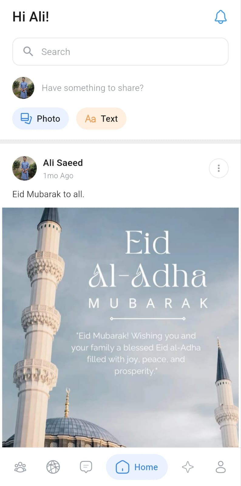
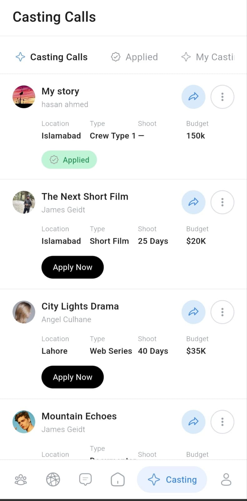
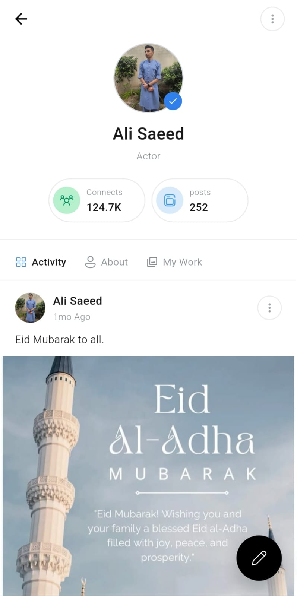

# You2Art — Flutter Creator Platform

A Flutter redesign for an art and creator 
platform. Profile management, carousel media 
pickers, and portfolio display — built with 
careful attention to how artists present 
their work.

## Screenshots

  
  &nbsp;&nbsp;&nbsp;&nbsp;&nbsp;&nbsp;&nbsp;&nbsp;
  
  &nbsp;&nbsp;&nbsp;&nbsp;&nbsp;&nbsp;&nbsp;&nbsp;
  

## Features
- Creator profile management
- Horizontal carousel media pickers
- Portfolio and gallery display
- Clean, minimal UI that stays out of the art
- Smooth animations and transitions

## Tech Stack
- Flutter & Dart
- Custom carousel components
- Firebase

## Getting Started
Clone the repo and run flutter pub get.
